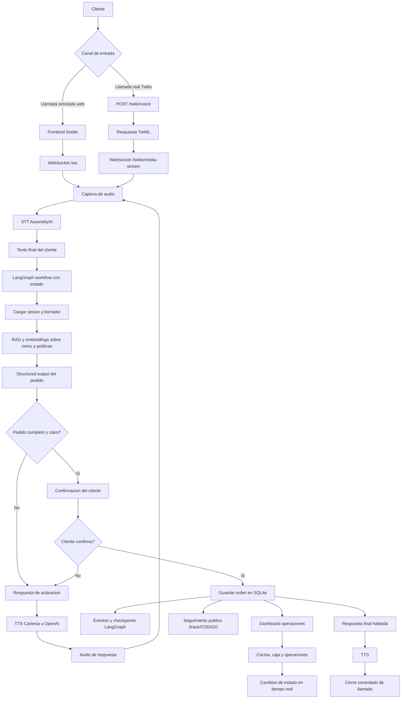

# Call Center Inteligente para Pedidos por Llamada

Aplicacion web de IA para atender pedidos por llamada simulada o telefonica, extraer la conversacion como una orden estructurada y mostrarla en modulos operativos en tiempo real.

## Funcionalidades principales

- Frontend web con Svelte 5 + Vite.
- Backend FastAPI.
- WebSocket `/ws` para llamada simulada con voz.
- Integracion opcional con Twilio Media Streams para llamadas reales.
- STT con AssemblyAI y TTS con Cartesia.
- Uso de LLM, structured output, tools y workflow con LangGraph.
- RAG con embeddings y busqueda semantica sobre SQLite.
- Panel interno por roles: admin, cocina, caja y operaciones.
- Seguimiento publico de pedidos por codigo.

## Estructura del proyecto

```text
components/
  python/    Backend FastAPI, LangGraph, RAG, seguridad y persistencia
  web/       Frontend Svelte/Vite
scripts/    Scripts de apoyo para arranque local y Twilio/ngrok
data/       Carpeta local para bases SQLite generadas en ejecucion
```

La carpeta `data/` no se versiona. Las bases SQLite se generan automaticamente cuando el backend inicia por primera vez.

## Requisitos

- Python 3.11 o superior.
- `uv`.
- Node.js con `corepack`.
- Claves de API para las funciones de IA/voz que se quieran probar.

## Configuracion

Copiar el archivo de ejemplo:

```powershell
Copy-Item .env.example .env
```

Editar `.env` con claves reales. Minimo recomendado para flujo completo con IA y voz:

```env
OPENAI_API_KEY=...
ASSEMBLYAI_API_KEY=...
CARTESIA_API_KEY=...
```

Twilio es opcional. Para llamadas telefonicas reales tambien se requiere:

```env
TWILIO_ACCOUNT_SID=...
TWILIO_AUTH_TOKEN=...
TWILIO_PHONE_NUMBER=...
```

No subas `.env` al repositorio. Solo `.env.example` debe estar versionado.

## Instalacion y ejecucion

Arranque automatico en Windows:

```powershell
.\start_project.bat
```

Ejecucion manual:

```powershell
cd components\web
corepack pnpm install
corepack pnpm build

cd ..\python
uv sync
uv run src/main.py
```

El backend sirve el frontend compilado desde `components/web/dist`, por eso se debe ejecutar el build web antes de iniciar FastAPI.

## Bases de datos

No es necesario subir bases SQLite al repositorio.

Al iniciar el backend, el sistema:

- crea `data/call_center.db` si no existe;
- crea tablas de productos, knowledge base, sesiones, borradores, pedidos, usuarios internos y eventos;
- carga productos demo, documentos de conocimiento y credenciales demo;
- crea `data/langgraph_checkpoints.db` para checkpoints de LangGraph;
- genera archivos auxiliares de SQLite como `*.db-wal` y `*.db-shm` cuando aplica.

Estos archivos son estado local de ejecucion y estan ignorados por Git.

## Diagrama de proceso



## Rutas principales

- `GET /` interfaz de llamada simulada.
- `GET /login` ingreso interno por roles.
- `GET /operations` dashboard operativo.
- `GET /admin` panel de inventario y limpieza de demo.
- `GET /track/{CODIGO}` seguimiento publico del pedido.
- `GET /api/menu` catalogo activo.
- `GET /api/kitchen/orders` ordenes.
- `GET /api/orders/{CODIGO}` detalle y trazabilidad del pedido.
- `GET /api/operations/overview` resumen operativo.
- `GET /api/knowledge/search?q=...` busqueda semantica.
- `POST /api/admin/reset-demo` reinicia estado de demo.
- `POST /api/auth/login` inicia sesion interna.
- `POST /api/auth/logout` cierra sesion interna.
- `WS /ws` pipeline de voz web.
- `WS /kitchen/ws` tiempo real operativo.

## Credenciales demo

Si no se sobreescriben por variables de entorno:

- `admin / admin123`
- `cocina / cocina123`
- `caja / caja123`
- `operaciones / operaciones123`

Para un entorno real, cambia estas claves en `.env`:

```env
STAFF_ADMIN_PASSWORD=...
STAFF_KITCHEN_PASSWORD=...
STAFF_CASHIER_PASSWORD=...
STAFF_OPERATIONS_PASSWORD=...
```

## Twilio y ngrok

Twilio es opcional. La llamada simulada web cubre el flujo principal sin numero telefonico real.

Para llamadas reales:

1. Configura una cuenta y un numero con voz en Twilio.
2. Expone el backend con ngrok u otra URL publica.
3. Configura los webhooks en Twilio:

```text
Voice:   POST https://TU-URL-PUBLICA/twilio/voice
Status:  POST https://TU-URL-PUBLICA/twilio/status
Message: POST https://TU-URL-PUBLICA/twilio/message
```

El endpoint `/twilio/voice` devuelve TwiML que abre automaticamente el WebSocket `wss://TU-URL-PUBLICA/twilio/media-stream`.

Scripts de apoyo:

```powershell
.\scripts\start_twilio_backend.ps1
.\scripts\start_ngrok_for_twilio.ps1 -NgrokExe "C:\ruta\ngrok.exe" -NgrokAuthtoken "TU_TOKEN"
```

## Demo limpia

Con el backend ejecutandose:

```powershell
.\scripts\reset_demo_state.ps1
```

Esto elimina pedidos, sesiones y eventos, y restaura el stock inicial.

## Verificacion

Backend:

```powershell
cd components\python
uv run pytest
```

Frontend:

```powershell
cd components\web
corepack pnpm install
corepack pnpm build
```

## Seguridad del repositorio

Este repositorio debe contener solo codigo fuente, scripts necesarios, archivos de dependencias, `.env.example` y este README.

No se versionan:

- secretos o credenciales reales;
- bases de datos locales;
- logs;
- dependencias instaladas;
- builds generados;
- documentacion o entregables academicos privados.
