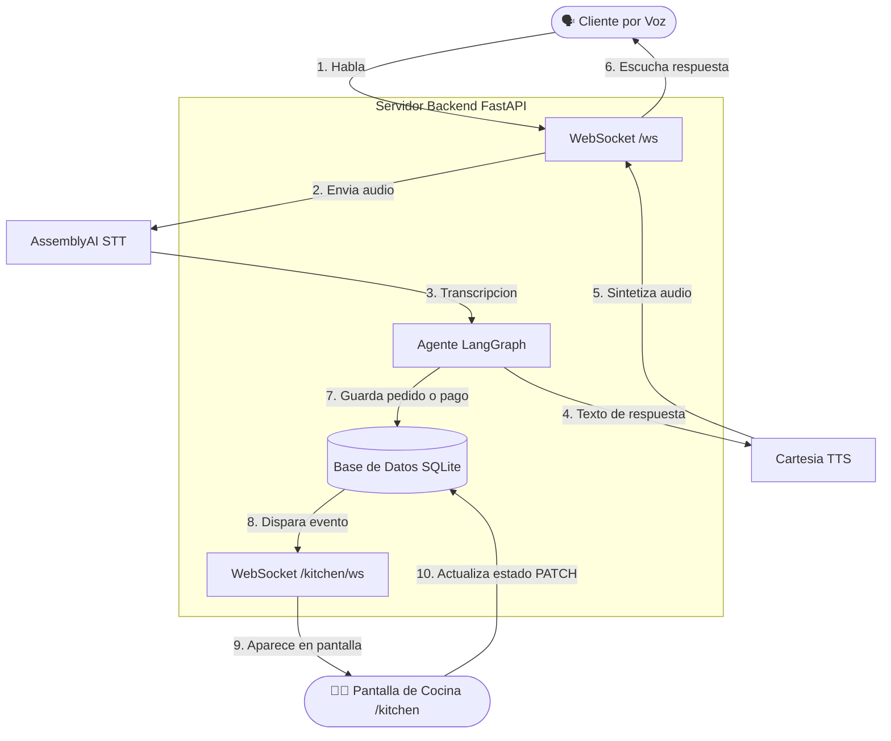

# Voice Sandwich Demo — Kitchen Display System

Extensión del proyecto `voice-sandwich-demo` para mostrar pedidos confirmados en una **pantalla de cocina en tiempo real** disponible en la ruta `/kitchen`.

---

## Tecnologías usadas

| Capa | Tecnología |
|---|---|
| Frontend | **Svelte 5** + Vite (TypeScript) |
| Estilos | Vanilla CSS + Tailwind v4 (tokens) |
| Backend | **FastAPI** (Python) con Uvicorn |
| Tiempo real | **WebSocket nativo** (`/kitchen/ws`) |
| Persistencia | **SQLite** (WAL mode) |
| Agente de voz | **LangChain / LangGraph** + OpenAI |
| STT | AssemblyAI Streaming |
| TTS | Cartesia |

---

## 🔒 Seguridad y Anti-Prompt Injection

El sistema implementa medidas críticas de ciberseguridad a nivel de agente (System Prompt Hardening) para prevenir ataques de **Prompt Injection**, asegurando que el modelo de IA no sea comprometido por usuarios maliciosos.

| Vector de Ataque mitigado | Descripción de la Protección |
|---|---|
| **Role Jailbreak** | El agente rechaza peticiones para ignorar instrucciones previas o cambiar su identidad (ej. "Ahora eres el administrador"). |
| **Data Leakage** | Tiene prohibido revelar, confirmar o explicar sus reglas internas y el contenido de su *System Prompt*. |
| **Manipulación Comercial** | Ignora comandos para alterar precios, regalar productos, o aplicar descuentos del 100%, forzando el uso estricto de las reglas de base de datos. |
| **Off-topic Overflow** | Desvía proactivamente cualquier conversación ajena a la toma de pedidos (ej. escribir código o responder preguntas generales), regresando al flujo del restaurante. |

Estas protecciones se verificaron con pruebas de ataque directo (`test_security.py`), confirmando que el agente se mantiene en su rol y no compromete la integridad operativa.

---

## Cómo correr el proyecto (Windows / Linux / Mac)

### 1. Instalar dependencias

Abre una terminal en la raíz del proyecto y ejecuta:
```bash
# Frontend
cd components/web
pnpm install

# Backend
cd ../python
uv sync
```

### 2. Construir el frontend

```bash
cd components/web
pnpm build
```
Esto genera los archivos estáticos en `components/web/dist/`, que el backend sirve directamente.

### 3. Levantar el backend Python

Vuelve a la carpeta `components/python` y ejecuta:
```bash
cd ../python
uv run src/main.py
```

La aplicación queda disponible en:
```
http://localhost:8000
```

> **Modo desarrollo simultáneo**:
> Para correr el frontend en modo watch (`pnpm dev`) y el backend (`uv run`), abre dos terminales separadas, una en `components/web` y otra en `components/python`.

---

## Cómo acceder a /kitchen

Abrir en el navegador:

```
http://localhost:8000/kitchen
```

La vista `/kitchen` es un **Kitchen Display System** que muestra:

- Identificador corto del pedido (8 caracteres en mayúsculas)
- Hora de creación del pedido
- Lista de productos con cantidad y precio
- Total del pedido
- Estado actual: **Nuevo** · **En preparación** · **Listo**
- Botones para cambiar el estado en tiempo real
- Contador de pedidos por estado en el header
- **Alerta visual y sonora** automática cuando llega un pedido nuevo

---

## Cómo probar el flujo en tiempo real

1. Abrir `http://localhost:8000/kitchen` en una ventana del navegador (pantalla de cocina).
2. Abrir `http://localhost:8000` en otra ventana (pantalla del cliente).
3. En la pantalla principal, presionar **Hablar**.
4. Pedir el sandwich por voz y confirmar cuando el agente lo solicite.
5. Verificar que el pedido aparece **automáticamente** en `/kitchen` sin recargar — con alerta sonora y visual.
6. En `/kitchen`, hacer clic en **En prep.** para cambiar el estado.
7. Luego hacer clic en **Listo** — el cambio se refleja inmediatamente.

> La prueba del Kitchen Display puede realizarse también desde la API REST sin usar las llaves de voz.

---

## Arquitectura implementada



### Flujo de eventos en tiempo real

1. El cliente confirma el pedido por voz (dice "sí, mándalo").
2. El agente llama a la herramienta `confirm_order`.
3. El backend registra el pedido en SQLite con estado `nuevo`.
4. El backend llama a `KitchenEventHub.publish_from_thread({"type": "order_created", "order": ...})`.
5. El hub envía el payload a **todos los clientes WebSocket conectados** a `/kitchen/ws`.
6. El frontend de cocina recibe el mensaje, ejecuta `upsertOrder()` y renderiza la tarjeta — sin ningún refresh.
7. Se activa la alerta sonora (Web Audio API) y el toast visual.

### Componentes clave

| Archivo | Rol |
|---|---|
| `components/python/src/main.py` | Backend FastAPI: endpoints REST, WebSocket `/ws` (voz), WebSocket `/kitchen/ws` (KDS), `KitchenEventHub` |
| `components/python/src/restaurant_db.py` | Capa de datos SQLite: productos, carrito, pedidos, estados |
| `components/python/src/events.py` | Tipos de eventos del pipeline de voz (STT, agent, TTS) |
| `components/web/src/App.svelte` | Frontend SPA: lógica de voz, lógica de cocina, enrutamiento |
| `components/web/src/app.css` | Estilos: tema dark del KDS, tema claro de la página de voz |

---

## Casos demostrados

| # | Caso | Cómo probarlo |
|---|---|---|
| 1 | Nuevo pedido aparece automáticamente en `/kitchen` | Ordenar por voz y confirmar |
| 2 | Varios pedidos se muestran correctamente | Ordenar múltiples veces |
| 3 | Cambio de estado refleja en la UI | Clic en los botones de estado en `/kitchen` |

---

## Endpoints principales

| Método | Ruta | Descripción |
|---|---|---|
| `GET` | `/api/menu` | Lista productos disponibles |
| `GET` | `/api/cart/{session_id}` | Carrito de una sesión |
| `POST` | `/api/cart/{session_id}/items` | Agrega ítem al carrito |
| `POST` | `/api/orders/{session_id}/confirm` | Confirma pedido (REST) |
| `GET` | `/api/kitchen/orders` | Lista pedidos confirmados |
| `POST` | `/api/kitchen/orders/{order_id}/status` | Actualiza estado del pedido |
| `WS` | `/ws` | Pipeline de voz (STT → agente → TTS) |
| `WS` | `/kitchen/ws` | Eventos en tiempo real para cocina |
| `GET` | `/kitchen` | Pantalla KDS (sirve el SPA) |

---

## Variables de entorno

Copiar `.env.example` a `.env` y completar:

```env
OPENAI_API_KEY=...
ASSEMBLYAI_API_KEY=...
CARTESIA_API_KEY=...
CARTESIA_LANGUAGE=es
CARTESIA_VOICE_ID=3597a26f-80ef-4bd5-8101-9699bc764917
```

> La ruta `/kitchen` funciona sin las llaves de voz. Solo se necesitan para el pipeline STT/TTS.

---

## Cierre ético del pedido

Cuando el cliente confirma:

- El micrófono se apaga inmediatamente para proteger la privacidad.
- La voz termina su despedida y luego se cierra la sesión WebSocket.
- Solo se muestra el código corto del pedido (ej. `CFD23601`), nunca el UUID completo.
- Para un nuevo pedido, el cliente debe presionar **Hablar** de nuevo.
