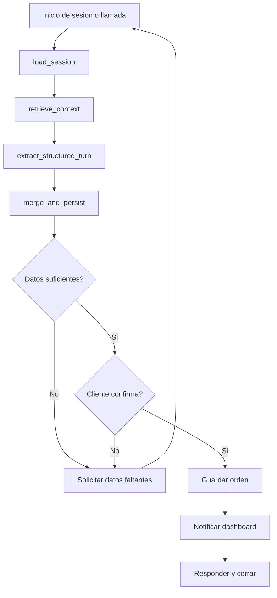

# High Level System Design

## Resumen

El sistema usa una arquitectura modular con frontend web, backend FastAPI, comunicacion en tiempo real por WebSocket, integracion telefonica opcional con Twilio, procesamiento de voz, workflow con LangGraph, RAG y persistencia SQLite.

## Diagrama de arquitectura

```mermaid
flowchart LR
    Cliente["Cliente"] --> Canal{"Canal de entrada"}
    Canal --> Web["Frontend Svelte"]
    Canal --> Twilio["Twilio Voice"]

    Web --> WSWeb["WebSocket /ws"]
    Twilio --> VoiceHook["POST /twilio/voice"]
    VoiceHook --> TwiML["TwiML de respuesta"]
    TwiML --> WSTwilio["WebSocket /twilio/media-stream"]

    WSWeb --> Audio["Audio del cliente"]
    WSTwilio --> Audio
    Audio --> STT["AssemblyAI STT"]
    STT --> Texto["Texto transcrito"]
    Texto --> Graph["LangGraph workflow"]

    Graph --> RAG["RAG y embeddings"]
    RAG --> Menu["Menu y politicas"]
    Graph --> Structured["Structured output"]
    Structured --> Decision{"Pedido completo?"}
    Decision -->|"No"| Aclaracion["Pedir aclaracion"]
    Decision -->|"Si"| Confirmacion["Confirmar pedido"]
    Confirmacion --> Persistencia["SQLite"]

    Persistencia --> Dashboard["Dashboard operativo"]
    Dashboard --> Roles["Cocina, caja y operaciones"]
    Persistencia --> Tracking["Seguimiento publico"]
    Graph --> TTS["TTS"]
    TTS --> Respuesta["Respuesta de voz"]
    Respuesta --> Cliente
```

## Componentes principales

### Frontend web

Aplicacion Svelte 5 con Vite. Permite interactuar con el sistema, usar la llamada simulada, iniciar sesion en paneles internos y consultar seguimiento publico de pedidos.

### Backend FastAPI

Expone rutas HTTP, WebSocket, webhooks de Twilio, autenticacion demo, endpoints operativos y archivos estaticos del frontend compilado.

### Twilio Gateway

Recibe llamadas telefonicas mediante `/twilio/voice`, responde TwiML y abre el stream bidireccional por `/twilio/media-stream`.

### Pipeline de voz

Convierte audio en texto con AssemblyAI y devuelve respuestas habladas mediante TTS.

### Workflow LangGraph

Organiza la conversacion en nodos y mantiene estado por sesion. El flujo incluye carga de sesion, recuperacion de contexto, extraccion estructurada, validacion, confirmacion y persistencia.

### RAG y embeddings

Permite recuperar informacion relevante del menu y politicas para responder preguntas y validar pedidos con contexto del negocio.

### Persistencia

SQLite guarda menu, sesiones, pedidos, eventos y checkpoints. Las bases runtime se crean automaticamente al ejecutar el backend por primera vez.

### Dashboard operativo

Muestra ordenes y cambios de estado para cocina, caja y operaciones. Usa endpoints HTTP y WebSocket para actualizacion en tiempo real.

## Diagrama del workflow conversacional

## Flujo de datos

1. El usuario envia audio desde la web o desde Twilio.
2. El backend recibe el audio por WebSocket.
3. El audio se transcribe.
4. El texto entra al workflow.
5. El workflow consulta RAG si necesita informacion del menu.
6. El modelo genera datos estructurados.
7. El sistema valida si el pedido esta completo.
8. El cliente confirma.
9. La orden se persiste.
10. Los paneles operativos reciben la actualizacion.

## Seguridad y etica

- No se suben archivos `.env`, logs ni bases de datos runtime.
- Las API keys se configuran por variables de entorno.
- La documentacion advierte limitaciones de uso y dependencia de servicios externos.
- Los datos locales de prueba deben limpiarse antes de demos publicas.
- Para produccion se deben cambiar credenciales demo y aplicar politicas reales de acceso.

## Despliegue esperado

Para una demo local:

1. Clonar el repositorio.
2. Configurar `.env`.
3. Ejecutar `start_project.bat` o el flujo manual del README.
4. Si se usa Twilio, iniciar ngrok y configurar los webhooks mostrados por el script.

Para produccion:

1. Usar HTTPS estable.
2. Reemplazar ngrok por dominio publico.
3. Migrar SQLite a una base administrada si se requiere concurrencia.
4. Configurar secretos en el proveedor de despliegue.
5. Habilitar monitoreo, backups y controles de acceso.

